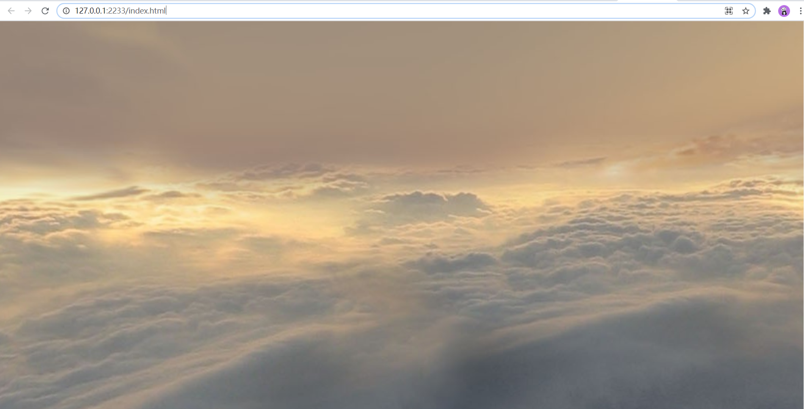
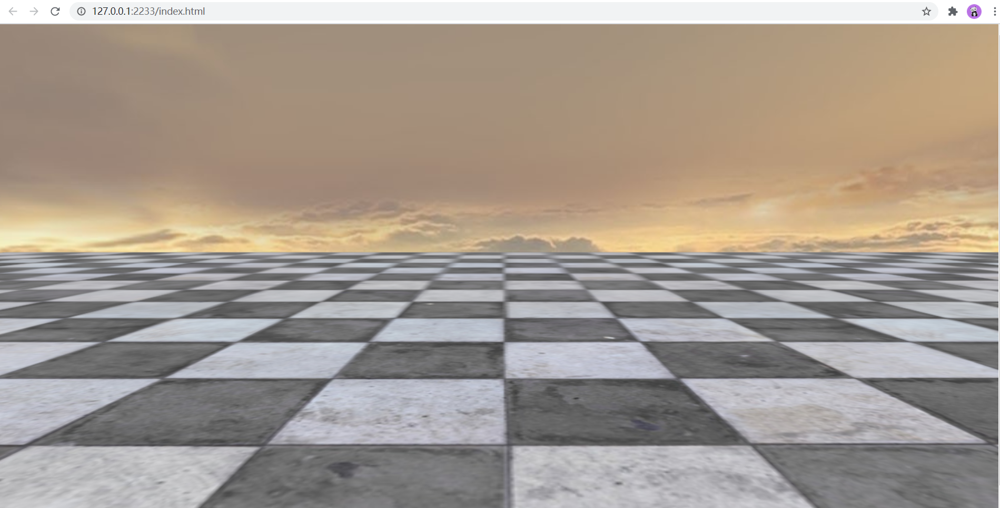
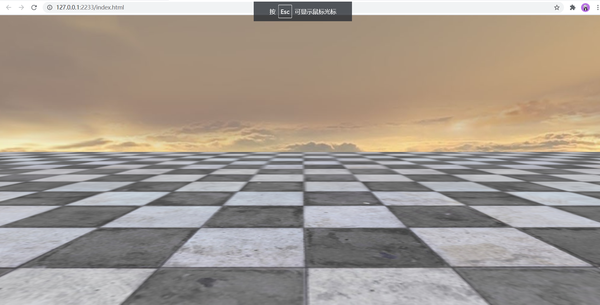
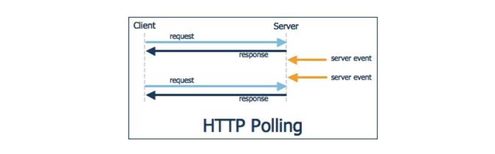
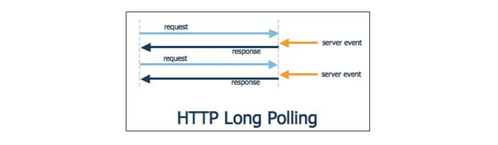
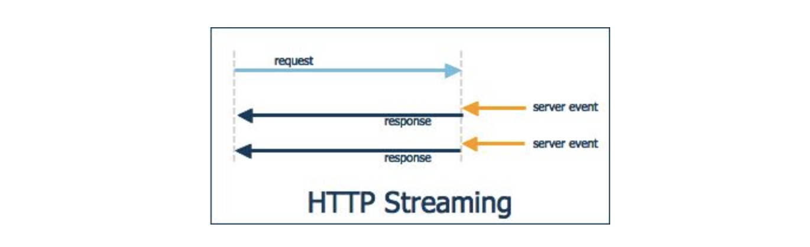
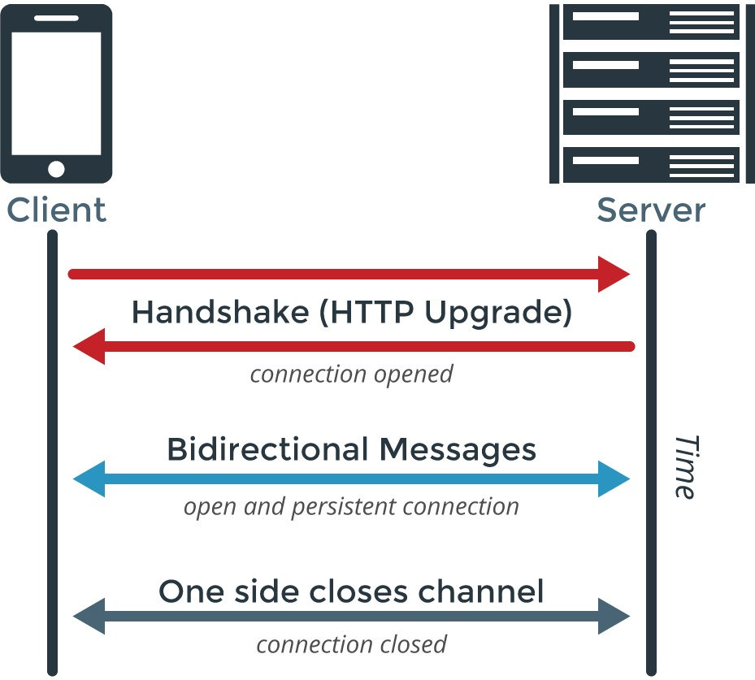
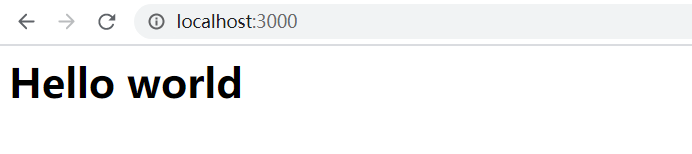
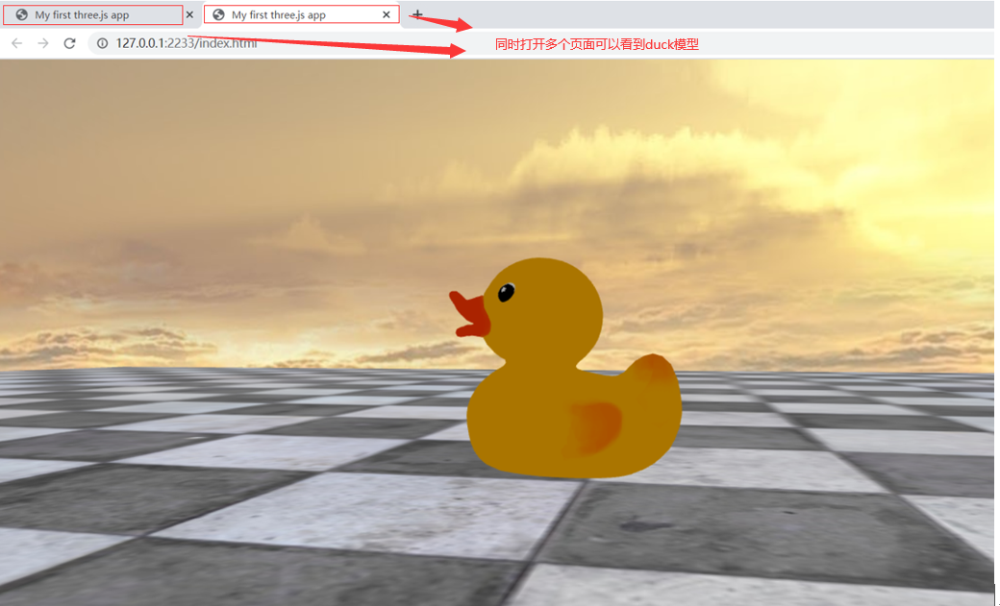
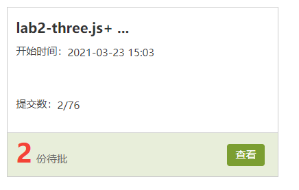

# Lab 3：Three.js 与 socket.io

## 概述

Lab 3 的主要内容包括：

- 使用 three.js 构建漫游场景
- 使用 socket.io 技术使web3d场景允许多人加入，并且行为共享。
- 使用 three.js 导入3D模型

## Part 1: Three.js

### 前言

three.js 是一个 WebGL 库，对 WebGL API 进行了很好的封装。它库函数丰富，上手容易，非常适合 WebGL 开发。

> three.js 的github地址：<https://github.com/mrdoob/three.js>
>
> three.js 的官方网址： https://threejs.org
>
> 首页左侧的 documentation 中是 three.js 的官方文档。
>
> 文档下方的 examples 中有许多经典的例子。
>
> 同学们学习 three.js 和开发 PJ 可以参考这两个。

### 准备工作

有两种方法使用three.js

* [下载](https://github.com/mrdoob/three.js/blob/dev/build/three.min.js)three.min.js并将他包含在你使用的html文件中。

  ```javascript
  <script src="js/three.min.js"></script>
  ```

* 使用npm安装three.js的[module](https://threejs.org/docs/index.html#manual/en/buildTools/Testing-with-NPM)并导入到你的项目中

  * npm 安装three模块

    ```shell
    npm i --save three
    ```

  * three模块的导入

    ```javascript
    // es6 style (recommended)
    import * as THREE from 'three'
    ```

接下来我们以第一种方法来构建一个web3d场景

### 一、场景（Scene）

首先，创建如下 HTML 文件（即 index.html）。

```html
<!DOCTYPE html>
<html>
	<head>
		<meta charset=utf-8>
		<title>My first three.js app</title>
		<style>
			body { margin: 0; }
			canvas { width: 100%; height: 100% }
		</style>
	</head>
	<body>
		<script src="js/three.min.js"></script>
		<script>
			// Our Javascript will go here.
		</script>
	</body>
</html>
```

接下来，在`<script>`标签内创建场景。

```javascript
const scene = new THREE.Scene();
```

场景是一个很重要的概念，每一个场景中都包含有摄像机、地形、天空盒子等对象，渲染时可以在不同的场景间进行切换。在资源紧张的应用中，场景还要负责游戏对象的创建和销毁工作。一般来说，游戏中的每一个关卡都是一个场景。

### 二、摄像机（Camera）

场景创建完毕后，需要向场景中添加摄像机，摄像机就跟人的眼镜一样，用来捕捉3D场景中的图像，而canvas就是人的视网膜，而摄像机看到的图像会被被渲染到canvas上，来与用户进行交互

每个场景都至少应包含一个摄像机。这里选择创建的摄像机为透视摄像机，摄像机捕获的内容占满整个页面，其视角为 45°，坐标为(0, 20, 50)，并将摄像机的镜头指向点(0, 15, 0)。 最后，将摄像机添加到场景中。

```javascript
const SCREEN_WIDTH = window.innerWidth, SCREEN_HEIGHT = window.innerHeight;
const VIEW_ANGLE = 45, ASPECT = SCREEN_WIDTH / SCREEN_HEIGHT, NEAR = 0.3, FAR = 1000;
const camera = new THREE.PerspectiveCamera(VIEW_ANGLE, ASPECT, NEAR, FAR);
camera.position.set(0, 20, 50);
camera.lookAt(new THREE.Vector3(0, 15, 0));
scene.add(camera);
```

### 三、渲染器（Renderer）

摄像机创建好后，就应该创建渲染器了。我们选择创建的渲染器为 WebGLRenderer，并设定为抗锯齿，渲染器渲染的内容同样占满整个页面。最后将渲染器内部的`<canvas>`对象添加到 body 中。

```javascript
const renderer = new THREE.WebGLRenderer({antialias: true});
renderer.setSize(SCREEN_WIDTH, SCREEN_HEIGHT);
document.body.appendChild(renderer.domElement);
```

抗锯齿 `antialias` 是创建 WebGLRenderer 时的一个可选参数，更多可选参数可以查[这里](https://threejs.org/docs/index.html#api/en/renderers/WebGLRenderer)。在学习 Three.js 时勤看文档是一个好习惯。

然后我们需要创建渲染回调函数。requestAnimationFrame 是浏览器提供的 JavaScript API，传递回调函数为参数。

```javascript
function render() {
  requestAnimationFrame(render);
  renderer.render(scene, camera);
}
render();
```

至此，一个场景所必备的基本要素已经完成，打开浏览器访问可以看到整个页面变成了全黑，接下来我们需要往场景中添加各种实体对象。

### 四、光照（Light）

一些材质的表现是受光照影响的，光照又分为以下几种

* 环境光（AmbientLight）
* 点光源（PointLight）
* 方向光源（DirectionalLight）
* 聚光灯（SpotLight）

其中，除环境光以外的光源支持阴影，具体每种光照请同学们自行参考官网学习

这里我们为场景简单地添加环境光

```javascript
// soft white light
const light = new THREE.AmbientLight( 0xaaaaaa );
scene.add( light );
```

### 五、物体相关概念

#### 1. 几何形状（Geometry）

* Three.js 中提供了许多预设的几何形状，如立方体（BoxGeometry），平面（PlaneGeometry），球体（SphereGeometry），立体文字（TextGeometry）等。使用 Geometry 可以方便地新建所需形状的物体。

* 在后面讲到的天空盒子使用的就是立方体形状（BoxGeometry）。

#### 2. 材质（Material）

* Material 对象定义了物体的材质，包括颜色、透明度、材质等等。Three.js 提供了一些预设材质，如 MeshBasicMaterial ，MeshPhongMaterial，MeshLambertMaterial 等，具体的 Material 参数与预设材质的定义请参考[文档](https://threejs.org/docs/index.html#api/en/materials/Material)。

#### 3. 贴图（Texture）

* Texture通过为物体的一个面或多个面添加图像，进行对物体表面细节处理。

* threejs通常采用THREE.TextureLoader对象来构造loader，通过loader去加载图像来完成texture的构建，具体的过程在后面的天空盒子里会介绍到。

#### 4. 网格（Mesh）

* Geometry和Material不能单独被渲染，只有结合成网格，才能被渲染到屏幕上。

### 六、添加物体

简单了解了物体的相关概念后，让我们向我们的场景中添加一些物体。

#### 1. 天空盒子

天空盒子和普通的几何物体并无不同。但天空盒子作为一种技术，可以将天空效果简单有效地表示出来，所以单独拿出来讲解。天空盒子，就是一个立方体对象。在实际应用中，用户视角只在盒子内部活动，所以只需要渲染盒子内部表面。值得注意的是，天空盒子应当足够大，使得摄像机在移动时看天空仍然觉得足够远。但是，天空盒子不能超出摄像机最远可视范围。

```javascript
// 首先创建一个盒子立方体，长宽高设为500
const skyBoxGeometry = new THREE.BoxGeometry(500, 500, 500);

// 接下来创建材质并映射到指定图片，设定为只渲染背面（对立方体来说，从外面看到的是正面，从内部看到的是背面）
const textureLoader = new THREE.TextureLoader();
const skyBoxMaterial = [
        new THREE.MeshBasicMaterial({map: textureLoader.load('./assets/textures/skybox/px.jpg'), side: THREE.BackSide}), // right
        new THREE.MeshBasicMaterial({map: textureLoader.load('./assets/textures/skybox/nx.jpg'), side: THREE.BackSide}), // left
        new THREE.MeshBasicMaterial({map: textureLoader.load('./assets/textures/skybox/py.jpg'), side: THREE.BackSide}), // top
        new THREE.MeshBasicMaterial({map: textureLoader.load('./assets/textures/skybox/ny.jpg'), side: THREE.BackSide}), // bottom
        new THREE.MeshBasicMaterial({map: textureLoader.load('./assets/textures/skybox/pz.jpg'), side: THREE.BackSide}), // back
        new THREE.MeshBasicMaterial({map: textureLoader.load('./assets/textures/skybox/nz.jpg'), side: THREE.BackSide})  // front
];

// 创建天空盒子并添加到场景
const skyBox = new THREE.Mesh(skyBoxGeometry, skyBoxMaterial);
scene.add(skyBox);
```

刷新页面，可以观察到被天空盒子包围的场景。



#### 2. 地板

地板是一个平面，导入地板的图片作为纹理，且纹理设为横向、纵向都重复 4 次。最后经过位移和旋转，添加到场景中。

添加如下代码：

```javascript
textureLoader.load("./assets/textures/floor/FloorsCheckerboard_S_Diffuse.jpg", function (texture) {
  texture.wrapS = texture.wrapT = THREE.RepeatWrapping;
  texture.repeat.set(4, 4);
  const floorMaterial = new THREE.MeshBasicMaterial({
      map: texture,
      side: THREE.DoubleSide
  });
  const floorGeometry = new THREE.PlaneGeometry(500, 500, 5, 5);
  const floor = new THREE.Mesh(floorGeometry, floorMaterial);
  floor.position.y = 0;
  floor.rotation.x = Math.PI / 2;
  scene.add(floor);
})
```

添加完成后，可以看到这样的场景



### 七、添加控制（Control）

添加了物体过后呢，我们仅仅看到的只是一个静态的渲染页面，接下来，我们希望通过不断移动照相机的位置，调整照相机的角度，来从各种角度观察3D场景，模拟第一人称视角，实现场景漫游效果。接下来的步骤中，我们添加对照相机的控制。

在js文件夹中，添加FirstPersonControls.js，创建FirstPersonControls类

> 注：这里的FirstPersonControls.js与threejs官方demo下的[FirstPersonControl](<https://github.com/mrdoob/three.js/blob/master/examples/js/controls/FirstPersonControls.js>)是有一定的区别的，学习官方demo的同学注意下这点。这里实现的功能类似于官网上[跳箱子](https://threejs.org/examples/#misc_controls_pointerlock)的demo，对于这一demo同学们可以参考源码[PointerLockControls.js](https://github.com/mrdoob/three.js/blob/master/examples/js/controls/PointerLockControls.js)和[misc_controls_pointerlock.html](https://github.com/mrdoob/three.js/blob/master/examples/misc_controls_pointerlock.html)

```javascript
class FirstPersonControls {
}
```

在index.html中导入

```html
<script src="js/FirstPersonControls.js"></script>
```

#### 1. 相机控制状态的进入和退出——鼠标点击

当我们想要控制相机时，我们调用dom元素的requestPointerLock方法进行鼠标光标的锁定，并为document的pointerlockchange事件做监听，来进入和退出控制状态。为pointerlockerror事件做监听，来判断浏览器能否使用该API

> 注：有关pointer lock相关的api，可以参考[这篇文档](https://developer.mozilla.org/en-US/docs/Web/API/Pointer_Lock_API)进行学习

```javascript
class FirstPersonControls  {
    constructor(domElement) {
        this.domElement = domElement || document.body;
        this.isLocked = false;
    }
    onPointerlockChange() {
        this.isLocked = document.pointerLockElement === this.domElement;
    }
    onPointerlockError() {
        console.error( 'THREE.PointerLockControls: Unable to use Pointer Lock API' );
    }
    connect() {
        this.domElement.addEventListener('click', this.domElement.requestPointerLock);
      	// 思考函数后面为什么要加bind(this)
        document.addEventListener( 'pointerlockchange', this.onPointerlockChange.bind(this), false );
        document.addEventListener( 'pointerlockerror', this.onPointerlockError.bind(this), false );
    }
}
```

并在index.html中加入以下部分

```javascript
const fpc = new FirstPersonControls()
fpc.connect()
```

可以看到，进入场景点击鼠标左键时，鼠标光标消失，按下ESC后，鼠标光标恢复



#### 2. 控制相机的旋转——鼠标移动

接下来，我们在锁定状态下，通过鼠标移动来控制相机的旋转。

* 为control添加camera
* 将camera封装进pitchObject，再将pitchObject封装进yawObject（请同学们思考为什么要这么做）
* 将yawObject添加到场景中

* 鼠标移动触发相关对象的旋转

```javascript
class FirstPersonControls  {
    constructor(camera, domElement) {
        this.domElement = domElement || document.body;
        this.isLocked = false;
        this.camera = camera;

        // 初始化camera, 将camera放在pitchObject正中央
        camera.rotation.set(0, 0, 0);
        camera.position.set(0, 0, 0);

        // 将camera添加到pitchObject, 使camera沿水平轴做旋转, 并提升pitchObject的相对高度
        this.pitchObject = new THREE.Object3D();
        this.pitchObject.add(camera);
      	this.pitchObject.position.y = 10;

        // 将pitObject添加到yawObject, 使camera沿竖直轴旋转
        this.yawObject = new THREE.Object3D();
        this.yawObject.add(this.pitchObject);
    }

    onPointerlockChange() {
        console.log(this.domElement);
        this.isLocked = document.pointerLockElement === this.domElement;
    }

    onPointerlockError() {
        console.error( 'THREE.PointerLockControls: Unable to use Pointer Lock API' );
    }

    onMouseMove(event) {
        if (this.isLocked) {
            let movementX = event.movementX || event.mozMovementX || event.webkitMovementX || 0;
            let movementY = event.movementY || event.mozMovementY || event.webkitMovementY || 0;

            this.yawObject.rotation.y -= movementX * 0.002;
            this.pitchObject.rotation.x -= movementY * 0.002;
						// 这一步的目的是什么
            this.pitchObject.rotation.x = Math.max( - Math.PI / 2, Math.min( Math.PI / 2, this.pitchObject.rotation.x ) );
        }
    }

    connect() {
        this.domElement.addEventListener('click', this.domElement.requestPointerLock);
        // 在函数后面添加bind(this)的目的是什么
        document.addEventListener('pointerlockchange', this.onPointerlockChange.bind(this), false );
        document.addEventListener('pointerlockerror', this.onPointerlockError.bind(this), false );
        document.addEventListener('mousemove', this.onMouseMove.bind(this), false);
    }

}
```

我们在index.html里面修改fpc的构造并添加下列语句

```javascript
// 修改fpc的构造，传入参数camera
const fpc = new FirstPersonControls(camera);
fpc.connect();
// 向场景添加用于控制相机的Object
scene.add(fpc.yawObject);
```


#### 3. 控制相机的移动——键盘控制

接下来，我们在锁定状态下，通过键位操作来控制相机的平移。

- 在FirstPersonControls类中定义onKeyUp和onKeyDown方法，分别绑定keydown和keyup事件
- 在FirstPersonContrls类中定义定义update方法，在每次render时调用该方法，传入两次render的时间间隔，来完成相机的移动。

```javascript
// W S A D 的keycode
const KEY_W = 87;
const KEY_S = 83;
const KEY_A = 65;
const KEY_D = 68;

class FirstPersonControls {
  constructor(camera, domElement) {
    // ...
    // 初始化移动状态
    this.moveForward = false;
    this.moveBackward = false;
    this.moveLeft = false;
    this.moveRight = false;
  }
  // ...
	onKeyDown(event) {
    switch (event.keyCode) {
      case KEY_W: this.moveForward = true; break;
      case KEY_A: this.moveLeft = true; break;
      case KEY_S: this.moveBackward = true; break;
      case KEY_D: this.moveRight = true; break;
    }
  }
	onKeyUp(event) {
    switch (event.keyCode) {
      case KEY_W: this.moveForward = false; break;
      case KEY_A: this.moveLeft = false; break;
      case KEY_S: this.moveBackward = false; break;
      case KEY_D: this.moveRight = false; break;
    }
  }

  update(delta) {
    // 移动速度
    const moveSpeed = 100;
    
    // 确定移动方向
    let direction = new THREE.Vector3();
    direction.x = Number(this.moveRight) - Number(this.moveLeft);
    direction.z = Number(this.moveBackward) - Number(this.moveForward);
    direction.y = 0;

    // 移动方向向量归一化，使得实际移动的速度大小不受方向影响
    if (direction.x !== 0 || direction.z !== 0) {
      direction.normalize();
    }
        
    // 移动距离等于速度乘上间隔时间delta
    if (this.moveForward || this.moveBackward) {
      this.yawObject.translateZ(moveSpeed * direction.z * delta);
    }
    if (this.moveLeft || this.moveRight) {
      this.yawObject.translateX(moveSpeed * direction.x * delta);
    }
	}

  connect() {
    // ...
    document.addEventListener('keydown', this.onKeyDown.bind(this), false);
    document.addEventListener('keyup', this.onKeyUp.bind(this), false);
  }
}
```

> 注：这里我们只需要w, s, a, d 四个键位，每个键位的KeyCode信息可以在 <https://keycode.info/> 中查到。

* 修改index.html中的 render部分

```javascript
let clock = new THREE.Clock();
function render() {	
	fpc.update(clock.getDelta());
	requestAnimationFrame(render);
	renderer.render(scene, camera);
}
```

> 注：这里我们通过[THREE.Clock对象](https://threejs.org/docs/index.html#api/en/core/Clock)来计算delta，还有很多其他的方法，请同学们自行研究

#### 4. 碰撞检测（可选）

碰撞检测包括的几种情况:

* 底部碰撞，这一种碰撞常常在重力场景会遇到。
* 周围碰撞，这一种碰撞一般在移动时会发生，周围碰撞又分为
  * 与场景碰撞
  * 与其他玩家碰撞（多人vr交互场景中出现）
* 顶部碰撞，这种碰撞一般在跳跃时发生。

碰撞检测可以有以下几种思路实现

* 通过[Raycaster](https://threejs.org/docs/index.html#api/en/core/Raycaster)，向模型顶点发出规定长度射线来判断相交并做相应的处理。
* 通过引入物理引擎，如[physijs](http://chandlerprall.github.io/Physijs/)。threejs的[car_demo](https://threejs.org/examples/#webgl_materials_cars)就是用physijs实现的

同学们可以根据自己project的需要，来学习本部分，本次lab对碰撞检测不作要求。

### 八、实现"响应式照相机"

相机在刚构建的时候，我们通过窗口的宽高比来设置相机的aspect(视锥宽高比)，当浏览器窗口宽高发生变化时，我们希望相机的aspect能随着浏览器窗口的变化跟着改变，从而实现"响应式照相机"，同时我们希望render也能响应窗口变化

在index.html中添加如下代码

```javascript
window.addEventListener("resize", onWindowResize);
function onWindowResize() {
  camera.aspect = window.innerWidth / window.innerHeight;
  camera.updateProjectionMatrix();
  renderer.setSize(window.innerWidth, window.innerHeight);
}
```

再次刷新页面，拉伸窗口我们能看到camera和renderer都有相应的变化。

至此，一个简单的漫游场景就实现了。推荐同学们以 three.js 官网为参考，首先浏览官方 examples ，查看 examples 的源代码，碰到问题时查阅 documentation。

> 相关链接：
>
> examples: https://threejs.org/examples/
>
> documentation: https://threejs.org/docs/index.html


## Part 2: WebSocket

### 前言

#### 服务器推送技术的发展

http协议的最大缺陷在于，通信只能由客户端发起，服务器无法推送消息。于是产生了各种各样的推送技术。

* HTTP Polling

  这种方式下，client 每隔一段时间都会向 server 发送 http 请求，服务器收到请求后，将最新的数据发回给 client。

  

* HTTP Long-polling

  client 向 server 发出请求，server 接收到请求后，server 并不一定立即发送回应给 client，而是看数据是否更新，如果数据已经更新了的话，那就立即将数据返回给 client；但如果数据没有更新，那就把这个请求保持住，等待有新的数据到来时，才将数据返回给 client。

  

* HTTP Streaming

  流技术基于 Iframe。Iframe 是 HTML 标记，这个标记的 src 属性会保持对指定 server 的长连接请求，server 就可以不断地向 client 返回数据。

  

* Web socket

  前面的技术都只考虑如何让 server 尽快 '回复' client 的请求，为了彻底解决 server 主动向 client 发送数据的问题，W3C 在 HTML5 中提供了一种 client 与 server 间如何进行全双工通讯的网络技术 WebSocket。WebSocket 是一个全新的、独立的协议，基于 TCP 协议，与 HTTP 协议兼容却不会融入 HTTP 协议，仅仅作为 HTML5 的一部分。

  与http的关系：

  * 都是应用层协议，基于TCP
  * websocket 在建立连接时需要借助http协议

  

> 注：以上内容参考自[知乎专栏](https://zhuanlan.zhihu.com/p/23467317)
>
> 更多的示例可以参考以下网站
>
> <https://www.websocket.org/>
>
> 关于demo可以参考socket.io框架下的一个聊天室
>
> <https://socket.io/demos/chat/>

### Socket.io

socket.io 主要使用 websocket 协议 

socket.io 是一个面向实时web应用的javascript库，他有两个部分：在浏览器中运行的客户端库，和一个面向Node.js的服务端库。两者有着几乎一样的API。像Node.js一样，它也是事件驱动的。

* 面向nodejs服务器的[socket.io](https://github.com/socketio/socket.io)
* 运行在浏览器端的[socket.io-client](https://github.com/socketio/socket.io-client)

接下来的实验中，我们将分别使用客户端和服务端的socket.io库来完成

### 前提条件

接下来的工作，我们会构造一个多人交互的web3D场景，这需要一些前提条件

* 完成Part1的部分，实现一个离线的漫游场景，还未完成的同学建议先完成Part1部分。
* 了解websocket协议，观察一些诸如聊天室的demo的工作原理，了解使用websocket能做什么。
* [socket.io](https://socket.io/)作为一个使用websocket协议的javascript库，了解socket.io在应用中是如何在客户端与服务端建立通信的。

### 准备工作

##### 服务端

我们采用nodejs服务器。

* 安装nodejs, npm工具，有以下两种安装方式

  * 前往[官网](https://nodejs.org/)下载安装
  * 使用[nvm](https://github.com/creationix/nvm)版本管理工具安装

  > 注：安装完成后检查nodejs和npm是否是最新版本

* 我们使用[express](https://expressjs.com/)框架与[socket.io](https://socket.io/)框架，使用npm安装express包与socket.io包

  ```shell
  mkdir server
  cd server
  npm init -y
  npm install --save express
  npm install --save socket.io
  ```

* 在server目录下创建index.js, 加入如下内容

  ```javascript
  var app = require('express')();
  var http = require('http').createServer(app);
  var io = require('socket.io')(http,{
    cors: {
      origin: "http://127.0.0.1:2233",
      methods: ["GET", "POST"]
    }
  });
  
  app.get('/', function(req, res){
      res.send('<h1>Hello world</h1>');
  });
  
  io.on('connection', function (socket) {
      console.log('client '+ socket.id + ' connected');
      socket.on('disconnect', function () {
          console.log('client ' + socket.id + ' disconnected');
      })
  });
  
  http.listen(3000, function(){
      console.log('listening on *:3000');
  });
  ```

* 在package.json的scripts项中加入一行"start"，表示start 这条script对应 “node index.js”

  ```json
  "scripts": {
    "test": "echo \"Error: no test specified\" && exit 1",
    "start": "node index.js"
  },
  ```

* 运行服务器

  ```shell
  npm start
  ```

  当你看到以下内容时，说明服务器已经成功运行在3000端口上

  ```
  > node index.js
  
  listening on *:3000
  ```

  向localhost:3000发送get请求，可以看到以下内容

  

##### 客户端

有两种方法使用面向客户端的socket.io

- 下载[socket.io.js](<https://github.com/socketio/socket.io-client/blob/master/dist/socket.io.js>)并将他包含在你使用的html文件中。

  ```javascript
  <script src="js/socket.io.js"></script>
  ```

- 使用npm安装socket.io-client的module并导入到你的项目中

  - npm 安装socket.io-client模块

    ```shell
    npm i --save socket.io-client
    ```

  - 模块的导入

    ```javascript
    // es6 style (recommended)
    import io from 'socket.io-client'
    ```

接下来我们采用第一种方法来构建客户端

在index.html中添加下面的语句

```javascript
const socket = io('ws://localhost:3000');
```

此时客户端的基本准备工作就完成了，

此时我们进入或离开客户端的3D场景时，可以看到服务端的控制台上会有相应的提示信息，说明连接已经成功

```shell
> node index.js

listening on *:3000
client dfHU9jpSSl6d4DEgAAAB connected
client dfHU9jpSSl6d4DEgAAAB disconnected
```

### 通信架构

建立连接过后，我们要考虑客户端与服务端之间进行怎样的通信，主要分为以下三个部分

* 客户端不断上传自己的实时信息（位置信息与旋转信息）

  在index.html中的renderer函数中加入以下代码，向服务端上传实时信息。

  ```javascript
  function render() {
  	fpc.update(clock.getDelta());
    socket.emit('player', {position: fpc.yawObject.position, rotation: fpc.yawObject.rotation});
  	requestAnimationFrame(render);
  	renderer.render(scene, camera);
  }
  ```

* 服务端接收每个客户端的实时信息（位置信息与旋转信息），并广播给其他客户端。当有某个客户端断开连接的时候，也要做一次广播。

  ```javascript
  io.on('connection', function (socket) {
      console.log('client '+ socket.id + ' connected');
      socket.on('player', function (data) {
        	data.socketid = socket.id;
          socket.broadcast.emit('player', data);
      });
      socket.on('disconnect', function () {
          console.log('client ' + socket.id + ' disconnected');
        	socket.broadcast.emit('offline', {socketid: socket.id});
      })
  });
  ```

* 客户端收到服务端传来的其他客户端的实时信息，并在自己的场景中更新。

  首先要在index.html中建立一个新的Map（该Map将其他客户端的socket.id映射到他们的模型上），来判断服务器发来的需要更新位置信息的客户端是否在场景中，如果没有在场景中，则需要为该客户新建一个模型，并把他加入到Map中，如果已经在场景中了，那只需要更新用户对应的模型的位置和旋转信息即可。

  首先，我们下载[GLTFLoader.js](https://github.com/mrdoob/three.js/blob/master/examples/js/loaders/GLTFLoader.js)到js文件夹里，并在index.html导入

  ```html
  <script src="js/GLTFLoader.js"></script>
  ```

  并在index.html中添加响应信息

  ```javascript
  let playerMap = new Map();
      socket.on('player', data => {
          if (playerMap.has(data.socketid)) {
              let model = playerMap.get(data.socketid);
              model.position.set(data.position.x, data.position.y, data.position.z);
              model.rotation.set(data.rotation._x, data.rotation._y + Math.PI / 2, data.rotation._z);
          } else {
              socket.emit('player', {position: fpc.yawObject.position, rotation: fpc.yawObject.rotation});
              const loader = new THREE.GLTFLoader();
              loader.load("./assets/models/duck.glb", (mesh) => {
                  //如果这个判断注释掉会怎么样，为什么
              	if(!playerMap.has(data.socketid)) {
  					mesh.scene.scale.set(10, 10, 10);
  					scene.add(mesh.scene);
  					playerMap.set(data.socketid, mesh.scene);
  					let model = playerMap.get(data.socketid);
  				}
              });
          }
      });
  socket.on('offline', data => {
    if (playerMap.has(data.socketid)) {
      scene.remove(playerMap.get(data.socketid));
      playerMap.delete(data.socketid)
    }
  });
  ```
  
  代码中标定的判断如果注释掉怎么样？并说出原因。此题作为加分题。

* 重启node服务端，打开两个浏览器窗口，我们可以看到每位玩家的实时信息都会在其他玩家的浏览器中以"duck"这个模型为载体展现出来。

  

  > 思考：如果把第四部分所添加的光照去掉，整个场景会变成什么样子？

至此，一个简单的muti-player的web3d虚拟环境就搭建出来了，有兴趣的同学可以尝试着给pj添加语义化的功能，为不同的虚拟环境创建"房间"，等等。

## Part 3.  提交

截止时间：2021/6/14 23：59：59

提交方式：超星学习通(提交到如下图中)<br/>


加分题：1、碰撞检测 2、通信架构部分客户端注释选择分支的意义 3、其他你认为有价值的部分。
